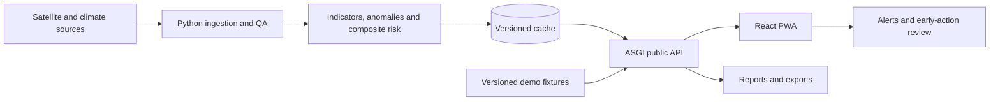

# Mwangaza

**Bringing Light to Early Action.** Mwangaza is a satellite-powered drought early-warning and decision-support prototype for the IGAD region. It helps analysts, local response teams and decision-makers turn vegetation, rainfall and land-surface-temperature evidence into understandable risk signals, alerts and early-action recommendations.

The current pilots demonstrate national Somalia analysis and subnational comparison across Turkana, Marsabit and Isiolo in Northern Kenya. Mwangaza supports anticipatory review; it does not issue official warnings or replace local knowledge.

## Requirements

- Python 3.11+
- Node.js 20+
- [`uv`](https://docs.astral.sh/uv/) and npm
- Git
- Optional for connected mode: an approved Google Earth Engine project and credentials

Windows users can run the commands below in PowerShell. On Linux/macOS, replace `$env:NAME="value"` with `export NAME=value`.

## Installation

```bash
uv sync --extra dev --extra app
npm ci
```

No secrets are needed for the offline demo.

## Offline demo

Reset the versioned baseline and run both deterministic scenarios:

```bash
uv run python scripts/reset_demo.py
uv run python scripts/demo_somalia.py
uv run python scripts/demo_kenya.py --unit KEN-010 --language sw
```

Start the API in PowerShell:

```powershell
$env:MWANGAZA_MODE="demo"
uv run uvicorn mwangaza.api.app:app --reload
```

In another terminal, start the PWA against the API:

```bash
npm run dev:api
```

Open `http://127.0.0.1:5173`. Demo responses expose `data_mode=demo`, `is_demo=true`, `reference_date` and `snapshot_id`; the UI keeps a visible demo banner on every route. The flow is local, does not initialize Earth Engine and sends no notifications.

If the managed demo baseline is corrupt, run `uv run python scripts/reset_demo.py`. The application does not silently overwrite invalid state.

## Connected mode

Connected mode requires an approved Earth Engine setup. Configure only the variable names described in [configuration](docs/configuration.md); never commit their values:

- `MWANGAZA_MODE=production`
- `MWANGAZA_GEE_PROJECT`
- `MWANGAZA_GEE_SERVICE_ACCOUNT`
- `MWANGAZA_GEE_PRIVATE_KEY_JSON`

Then start the API and PWA with the same `uvicorn` and `npm run dev:api` commands above. Production may degrade explicitly to a valid cache, but never to demo. Missing credentials or unavailable live data produce a visible degraded/error state. See the [threat model](docs/security/threat-model.md) and [privacy guidance](docs/security/privacy.md).

## Architecture



The browser consumes processed API/cache payloads and never queries Earth Engine directly. `live`, `cache` and `demo` modes remain explicit. Detailed design lives in [ARCHITECTURE.md](docs/ARCHITECTURE.md); source lineage is documented in [data provenance](docs/data-provenance.md).

## Technology stack

- Python 3.11+, ASGI and Uvicorn
- Google Earth Engine Python API
- React 18, TypeScript, Vite and `react-simple-maps`
- Vitest and Testing Library
- `unittest`, pytest, Ruff, MyPy and Coverage.py
- GitHub Actions

## Implemented today

- Deterministic offline demo plus explicit live/cache/demo provenance
- NDVI, rainfall and land-surface-temperature observation/anomaly workflows
- Data quality, spatial aggregation, composite risk and configurable prototype thresholds
- Alerts, early-action recommendations, audit trail and simulated notification outbox
- React PWA routes for Overview, Regions, Alerts, Reports, About, Admin and Technical status
- Somalia and Northern Kenya end-to-end scenarios
- Low-bandwidth, multilingual and installable PWA behavior
- Public read API, local exports, report previews, security controls and observability
- Canonical data-provenance catalog and responsible-use methodology

Capabilities labelled demo, simulated, placeholder or preview are implemented only at that stated maturity; they are not production delivery claims.

## Testing and verification

Run the same quality checks represented in CI:

```bash
uv run python -m unittest discover -s tests
npm run lint
npm run typecheck
npm test
npm run build
```

CI additionally runs backend lint/typecheck, contract tests and the configured coverage threshold. The scenario and reset commands in the Offline demo section are exercised by versioned E2E/demo tests; the public API and canonical React routes have automated smoke coverage.

## Docker quick start

With Docker Desktop running, build and start the non-root API and web containers:

```bash
docker compose up --build -d
```

Open [http://127.0.0.1:18080](http://127.0.0.1:18080). The API is also exposed locally on
`http://127.0.0.1:18081`, while browser API requests use the web container's same-origin proxy.
This local stack starts explicitly in demo mode and does not require Google Earth Engine
credentials. Stop it with:

```bash
docker compose down --remove-orphans
```

To build and verify all health, readiness, proxy and SPA routes before leaving the containers
running, use `uv run python scripts/smoke_containers.py --keep`. For Google Cloud setup,
secrets, deployment, diagnostics and rollback, see the
[Cloud Run deployment guide](docs/deployment/cloud-run.md).

The production refresh uses the same CLI locally, in CI and in the Cloud Run Job. Verify its
container without contacting GEE or writing a snapshot with:

```bash
docker compose --profile refresh run --rm refresh --dry-run
```

## Configuration

Use `.env.example` only as a list of supported names and safe placeholders. Keep secrets outside source control. `MWANGAZA_MODE=demo` is the sole explicit demo switch; `MWANGAZA_ENV` remains the application environment profile and is not a substitute for opting into demo data. Full rules: [configuration](docs/configuration.md).

## Limitations

- This is a decision-support prototype, not an official IGAD public-warning service.
- Pilot-level coverage is limited; missing geometry or snapshots degrade to explicit accessible placeholders.
- Satellite products have clouds, QA gaps, aggregation effects and publication latency.
- Land-surface temperature is not air temperature.
- Exposure means potentially exposed population, not confirmed affected people.
- Connected mode depends on separately authorized Earth Engine access and reliable upstream data.
- Simulated notifications, report previews and demo fixtures do not represent real delivery or live operational assessments.

## Responsible use

Treat alerts and recommendations as evidence for human review, not automatic humanitarian, medical, financial or operational orders. Validate outputs with local expertise, current field information, source terms and institutional procedures. Prototype thresholds are configurable and not official.

## Production refresh

Scheduled refresh is implemented as an out-of-request job with locking, immutable snapshots,
atomic last-good promotion and explicit freshness metadata. Deployment still requires an
authorized GCP project, Earth Engine service credentials and the operator steps in the
[Cloud Run deployment guide](docs/deployment/cloud-run.md).

## Project documentation

- [Architecture](docs/ARCHITECTURE.md)
- [Data provenance and methodology](docs/data-provenance.md)
- [Automated testing](docs/testing.md)
- [Security threat model](docs/security/threat-model.md)
- [Privacy](docs/security/privacy.md)
- [Repository conventions](docs/CONVENTIONS.md)

Mwangaza is released under the MIT license declared in `pyproject.toml`.
